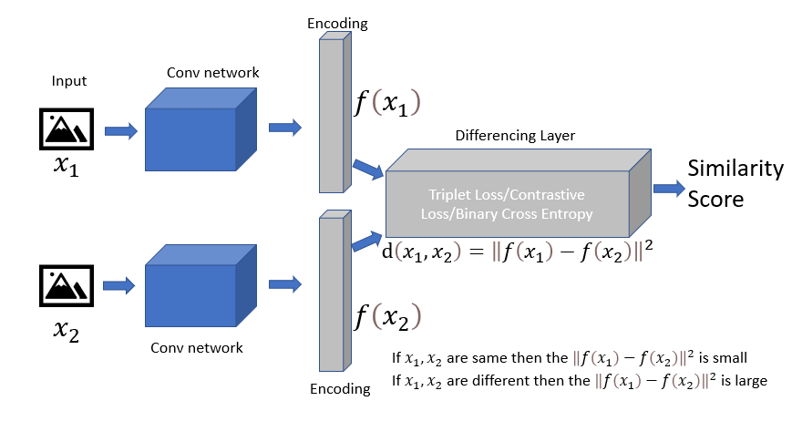

# KNN classifier based on siamese network embedding
## Introduction
The purpose of this project is to construct a [Siamese network](#siamese-network) and use its embedding to train a [knn classifier](#k-nearest-neighbour) to classify the [Alzheimer's Disease Neuroimaging Initiative (ADNI)](#adni-dataset) brain dataset.

### ADNI Dataset
The ADNI dataset that use in here comprises 30,520 MRI brain slice in total. Of these, 14,860 images are associated with Alzheimer’s disease (AD), while 15,660 images correspond to cognitively normal (NC) conditions.
, .

### Siamese Network
A Siamese network is a distance-based neural network. It consists of two weight-shared subnetworks and a designated loss function. The network takes two images as inputs, and then pass through their corresponding subnetworks for feature extraction. These subnetworks produce two flattened layers, called embeddings, which are then fed into the loss function. 
.

In this project, contrastive loss will be used. The definition of contrastive loss is $L(x_1, x_2, y) = (1 - y) \times \frac{1} {2} D^2 + y \times \frac {1} {2} max(0, m - D)^2$ where $y$ is label, $D$ is distance and $m$ is margin. When the distance between two inputs are smaller than margin, they will be considered as similar (y = 0), dissimilar otherwise (y = 1). This loss function will pull similar samples closer to each other while push dissimilar samples away.

### K Nearest Neighbour classifier
The knn classifier utilizes the embeddings from the Siamese network as its dataset. It predicts the label of new sample based on the majority vote from its k nearest neighbors. 

## Reference
https://medium.com/swlh/one-shot-learning-with-siamese-network-1c7404c35fda
